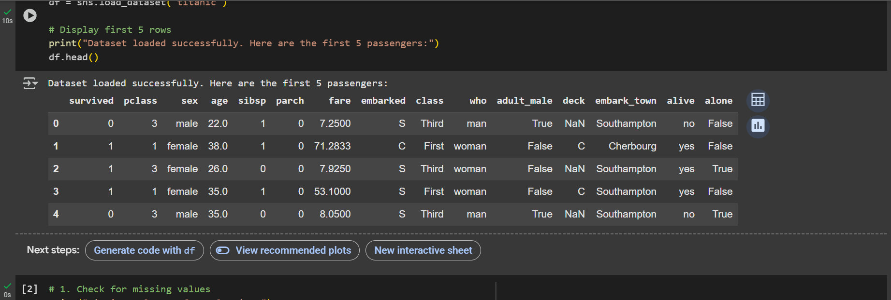
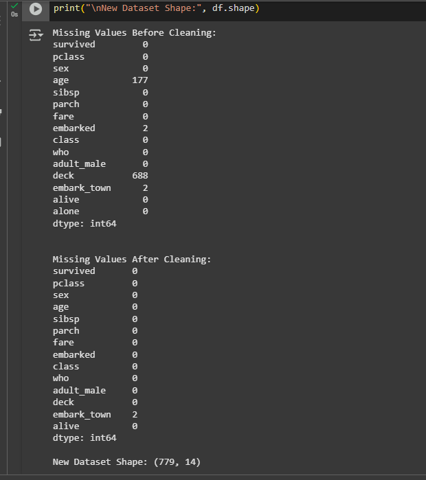
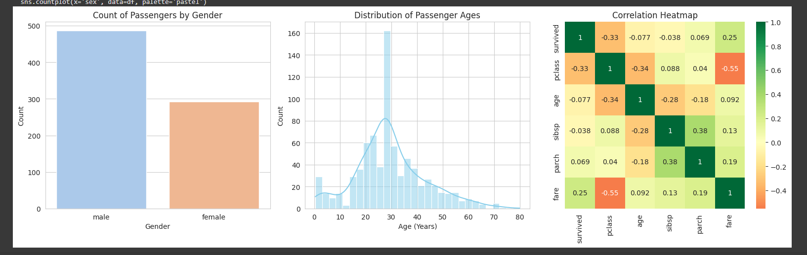
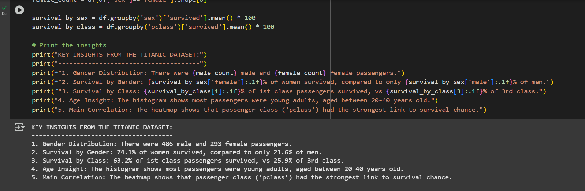

# Titanic Dataset - Exploratory Data Analysis (EDA)

## Project Description
This project performs an Exploratory Data Analysis (EDA) on the famous Titanic dataset using Python in Google Colab. The goal is to uncover basic patterns and relationships within the data, focusing on factors that influenced passenger survival.

## Tasks Performed
1.  **Data Loading:** Loaded the dataset using Pandas from the Seaborn library.
2.  **Data Cleaning:**
    - Handled missing values in `age` and `fare` by filling with the median.
    - Handled missing values in `embarked` and `deck` by filling with the mode (most frequent value).
    - Removed the `alone` column and any duplicate rows.
3.  **Data Visualization:**
    - Bar chart showing the count of male vs. female passengers.
    - Histogram showing the distribution of passenger ages.
    - Correlation heatmap for numerical variables.
4.  **Insights:** Summarized key findings from the analysis.

## Key Insights
The analysis revealed the following key insights:
1.  **Gender Distribution:** There were 486 male and 293 female passengers.
2.  **Survival by Gender:** 74.1% of women survived, compared to only 21.6% of men.
3.  **Survival by Class:** 63.2% of 1st class passengers survived, vs 25.9% of 3rd class.
4.  **Age Insight:** The histogram shows most passengers were young adults, aged between 20-40 years old.
5.  **Main Correlation:** The heatmap shows that passenger class ('pclass') had the strongest link to survival chance.

## Files in this Repository
- `Titanic_EDA.ipynb`: The main Jupyter Notebook containing the complete code and output.
- `Screenshots1/`: Folder containing screenshots of the results.

## How to Run
1.  Open the `Titanic_EDA.ipynb` file in Google Colab or a local Jupyter Notebook environment.
2.  Run the cells sequentially to see the analysis.

## Visuals
### 1. Data Preview

### 2. Data Cleaning Confirmation

### 3. Visualizations

### 4. Key Insights

